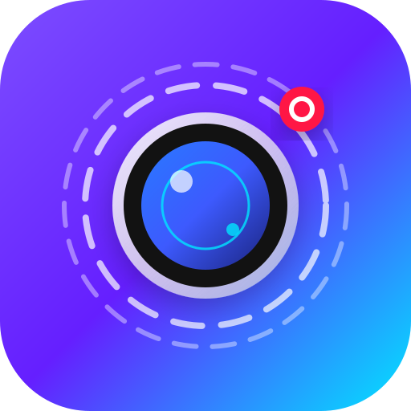

# MotionCraft 📸 (Live Photos Studio)

<p align="center">
  
</p>

<p align="center">
  <b>Android 实况照片 (Live Photos / Motion Photos) 查看、转换、合成与批量管理应用</b>
</p>

<p align="center">
  <a href="LICENSE"></a>
  <a href="https://kotlinlang.org"></a>
  <a href="https://developer.android.com/jetpack/compose"></a>
  <a href="https://www.android.com/"></a>
  <a href="CHANGELOG.md"></a>
</p>

---

## 📖 项目简介

**MotionCraft** 是一款运行于 Android 平台的实况照片工具。支持解析 iOS Live Photo 与 Android Motion Photo（遵循 ISO/IEC 16684-1 XMP 与 Google Motion Photo 规范），兼容 Apple iOS 以及小米、华为、三星、OPPO、vivo 等主流设备的实况照片格式。

应用提供实况照片扫描播放、提取视频/封面、视频转实况照片以及图片视频配对合成功能。

---

## 🌟 核心功能

- 📸 **实况图集管理**
  - 自动扫描本地相册中包含微视频 (`MicroVideoOffset`) 的实况照片。
  - 支持网格列表查看与长按多选批量删除。
- 🎬 **实况照片播放**
  - 长按卡片即可播放动态微视频，支持全屏预览与手势交互。
- 🔄 **视频与实况互转**
  - 从普通视频生成标准的 Android Motion Photo (JPEG + MP4)。
  - 从 Live Photo 中提取独立的 MP4 视频与 JPEG 封面图片。
- 🔗 **图片与视频合成**
  - 支持选择独立的图片与短视频，写入 XMP 元数据并合成为实况照片。
- 🛠️ **XMP 元数据查看**
  - 查看媒体文件的 `GCamera:MicroVideo` 和 `MicroVideoOffset` 等元数据参数。

---

## 📱 应用界面

| 实况图集 | 视频转实况 | 双选配对 | 系统设置 |
| :---: | :---: | :---: | :---: |
|  |  |  |  |
| 本地实况照片识别与展示 | 视频截取封面与合成 | 图片与视频手动合并 | 基础配置与主题设置 |

---

## 🔬 技术原理

Android Motion Photo 格式将 JPEG 封面图与 MP4 视频文件存储在同一文件中：

```
+--------------------------------+----------------------------+
|  JPEG Image Data               |  Embedded MP4 Video Data   |
|  (Contains XMP App1 Segment)   |  (At the end of file)      |
+--------------------------------+----------------------------+
  ^                              ^
  |                              |
  +-- MicroVideoOffset Specifies -+
```

1. **XMP 偏移定位**：读取 JPEG 标头（`0xFFE1` APP1 Marker），解析 `GCamera:MicroVideoOffset` 获取末尾 MP4 视频流的起始字节位置。
2. **视频提取**：使用 `RandomAccessFile` 根据偏移量直接定位并读取尾部 MP4 数据。
3. **播放控制**：基于 Media3 ExoPlayer 绑定 Compose View 进行手势触发播放。

---

## 📂 项目结构

```
MotionCraft/
├── app/                        # Android 应用主模块
│   └── src/
│       ├── main/
│       │   ├── java/com/example/
│       │   │   ├── data/       # Room 数据库、Entity、DAO 与 Repository
│       │   │   ├── model/      # LivePhoto、XmpMetadata 等数据结构
│       │   │   ├── parser/     # XMP 元数据解析与文件偏移提取
│       │   │   ├── ui/         # Jetpack Compose 界面 (Home, Player, Converter, Settings)
│       │   │   └── util/       # XMP 写入、视频编码与文件工具
│       │   └── res/            # 图标、字符串 (strings.xml)、主题等资源
│       └── test/               # 单元测试与 Robolectric 测试
├── .github/                    # CI/CD 与 Workflows 配置
├── Screenshot/                 # 应用截图目录
├── CONTRIBUTING.md             # 贡献指南
├── CHANGELOG.md                # 更新日志
├── SECURITY.md                 # 安全政策
├── LICENSE                     # 开源协议 (Apache 2.0)
└── README.md                   # 项目说明文档
```

---

## 🚀 构建说明

使用 Gradle 编译 Release APK：

```bash
./gradlew assembleRelease
```

构建产物目录：`app/build/outputs/apk/release/`

---

## 📄 开源协议

本项目采用 [Apache 2.0 License](LICENSE) 开源。
