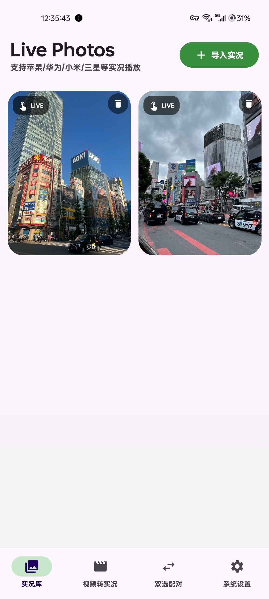
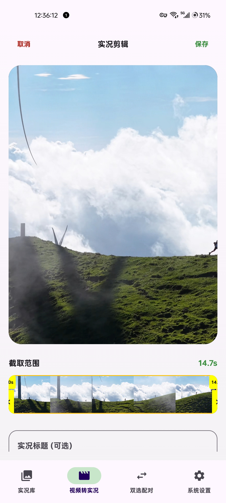
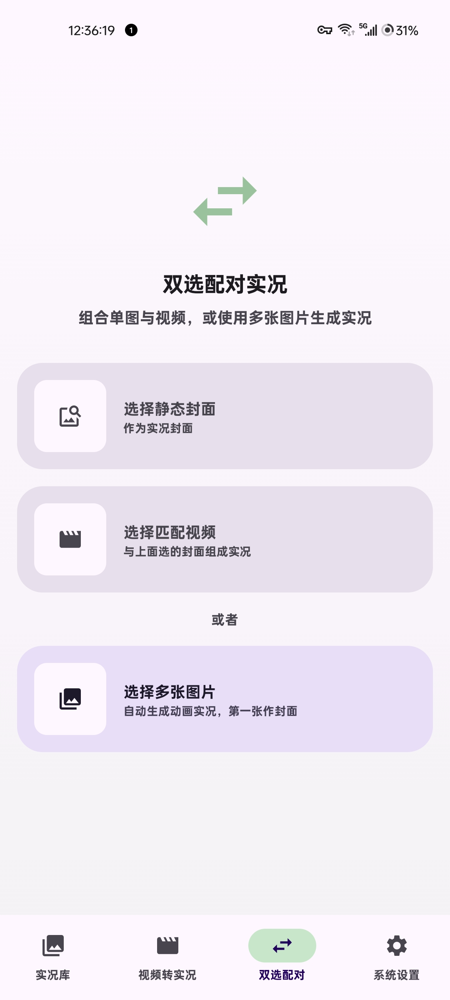
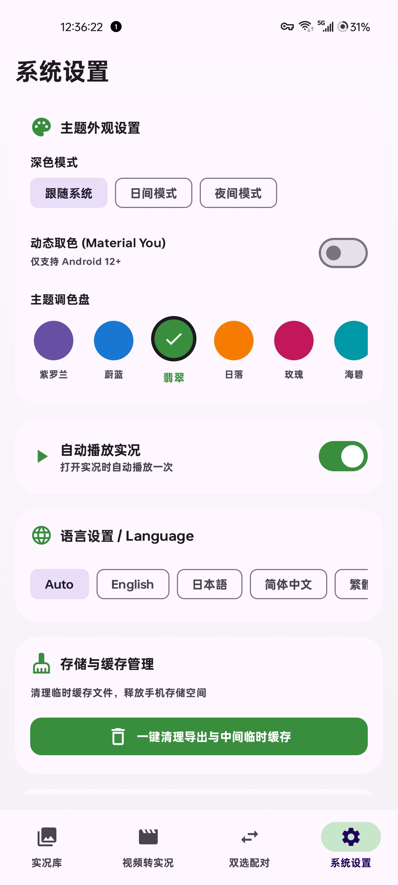

# MotionCraft 📸 (Live Photos Studio)

<p align="center">
  
</p>

<p align="center">
  <b>一款高性能跨平台实况照片 (Live Photos / Motion Photos) 查看、转换、合成与批量管理 Android 应用</b>
</p>

<p align="center">
  <a href="LICENSE"></a>
  <a href="https://kotlinlang.org"></a>
  <a href="https://developer.android.com/jetpack/compose"></a>
  <a href="https://www.android.com/"></a>
  <a href="CHANGELOG.md"></a>
</p>

---

## 📖 项目简介 (Overview)

**MotionCraft** 是一款专为 Android 打造的高性能跨平台实况照片查看、转换、合成与批量管理应用。项目基于 ISO/IEC 16684-1 XMP 与 Google Motion Photo / MicroVideo 规范，深度兼容 **Apple iOS Live Photo**、**Google Motion Photo** 以及**小米、华为、三星、OPPO、vivo** 等主流手机厂商的实况照片格式。

解开各大手机品牌间实况照片传输不兼容的壁垒，实现实况无损互转与单文件优雅封装。

---

## 🌟 核心功能亮点 (Key Features)

- 📸 **实况图集管理 (Live Photo Gallery)**
  - 自动高效扫描本地相册中包含微视频 (`MicroVideoOffset`) 的实况照片。
  - 支持**长按网格开启批量多选模式**，快速批量删除与流畅交互动画。
- 🎬 **沉浸式播放器 (Immersive Live Playback)**
  - 基于 Media3 ExoPlayer 的零延迟硬解码播放，长按即可流畅播放动态微视频。
  - 拥有高斯模糊实时背景与弹性卡片缩放 (Spring Animation)，自动隐藏系统状态栏与导航栏。
- 🔄 **视频与实况互转 (Video / Photo Conversion)**
  - 支持选择任意短视频导出封面并编码成标准的 Android Motion Photo (JPEG + MP4)。
  - 支持从任意 Live Photo 中无损提取单独的 1080P/4K 高清 MP4 视频与 JPEG 封面。
- 🔗 **双选配对合成 (Manual Asset Pairing)**
  - 自由组合独立拍摄的静态图片 (JPEG/PNG) 与短视频 (MP4)，注入 XMP Marker 节点合成标准实况照片。
- 🛠️ **XMP 诊断与缓存优化 (XMP Tools & Maintenance)**
  - 内置 XMP 结构诊断节点查看器，秒级分析 `GCamera:MicroVideo` 与偏移字节量。
  - 提供一键清理视频临时提取缓存与内存释放机制。

---

## 📱 应用界面截图 (App Screenshots)

| 实况图集 (Gallery) | 视频转实况 (Convert) | 双选配对 (Pairing) | 系统设置 (Settings) |
| :---: | :---: | :---: | :---: |
|  |  |  |  |
| 支持全品牌实况识别与展示 | 视频序列帧截取与编码 | 静态图片与视频自由配对 | 主题调色盘与动态取色 |

---

## 🔬 技术原理 (Technical Architecture)

Android 与 iOS 中的实况照片 (Motion Photo / Live Photo) 本质上是将**高分辨率静态封面图 (JPEG)** 与**短视频流 (MP4)** 封存在同一个文件中的复合媒体格式。

```
+-------------------------------------------------------------+
|                     Motion Photo File                       |
+--------------------------------+----------------------------+
|  JPEG Image Data               |  Embedded MP4 Video Data   |
|  (Contains XMP App1 Segment)   |  (At the end of file)      |
+--------------------------------+----------------------------+
  ^                              ^
  |                              |
  +-- MicroVideoOffset Specifies -+
```

1. **XMP 偏移定位**: 扫读 JPEG 标头 `0xFFE1` (APP1 Marker)，解析 `GCamera:MicroVideoOffset` 定位嵌入 MP4 视频流在文件末尾的起始字节位置。
2. **高效流截取**: 使用 Kotlin 协程与 `RandomAccessFile` 跳过图片数据，零延迟分段抽取尾部 MP4 文件。
3. **ExoPlayer 硬解码无缝播放**: 提取后的视频直接与 Jetpack Compose `AndroidView` 绑定，通过手势触控触发静音循环播放。

---

## 📂 项目结构 (Project Structure)

```
MotionCraft/
├── app/                        # 主应用模块
│   └── src/
│       ├── main/
│       │   ├── java/com/example/
│       │   │   ├── data/       # Room 数据库, Entity, DAO 与 Repository
│       │   │   ├── model/      # LivePhoto, XmpMetadata 等数据模型
│       │   │   ├── parser/     # XMP 节点解析器与二进制流截取引擎
│       │   │   ├── ui/         # Jetpack Compose 界面 (Home, Player, Converter, Settings)
│       │   │   └── util/       # 视频合成、XMP 注入与文件工具类
│       │   └── res/            # 图标、字符串 (strings.xml)、主题资源
│       └── test/               # 单元测试与 Robolectric 测试
├── .github/                    # Issue 模板与 CI 配置
├── Screenshot/                 # 手机真实效果截图资源目录
├── CONTRIBUTING.md             # 开源贡献指南
├── CHANGELOG.md                # 版本更新日志
├── SECURITY.md                 # 安全政策
├── LICENSE                     # Apache 2.0 开源协议
└── README.md                   # 项目主文档
```

---

## 🚀 快速开始与构建说明 (Getting Started)

### 环境要求 (Prerequisites)
- **Android Studio**: Iguana (2023.2.1) 或更高版本 (推荐 Ladybug)
- **JDK Version**: JDK 17
- **Target SDK**: Android 14 (API 34)
- **Min SDK**: Android 8.0 (API 26)

### 本地编译步骤 (Build Steps)

1. 克隆代码库：
   ```bash
   git clone https://github.com/your-username/MotionCraft.git
   cd MotionCraft
   ```

2. 使用 Gradle 编译 Debug APK：
   ```bash
   ./gradlew assembleDebug
   ```
   编译生成的 APK 位于：`app/build/outputs/apk/debug/app-debug.apk`

---

## 🤝 贡献与社区 (Contributing)

非常欢迎任何形式的贡献！在提交 Issue 或 Pull Request 前，请先阅读我们的 [CONTRIBUTING.md](CONTRIBUTING.md)。

- 🐛 发现 Bug？提交 [Bug Report](.github/ISSUE_TEMPLATE/bug_report.md)
- 💡 有新想法？提交 [Feature Request](.github/ISSUE_TEMPLATE/feature_request.md)

---

## 📄 开源协议 (License)

```
Copyright 2026 MotionCraft Open Source Community

Licensed under the Apache License, Version 2.0 (the "License");
you may not use this file except in compliance with the License.
You may obtain a copy of the License at

    http://www.apache.org/licenses/LICENSE-2.0

Unless required by applicable law or agreed to in writing, software
distributed under the License is distributed on an "AS IS" BASIS,
WITHOUT WARRANTIES OR CONDITIONS OF ANY KIND, either express or implied.
See the License for the me.
```
详见 [LICENSE](LICENSE) 文件。
