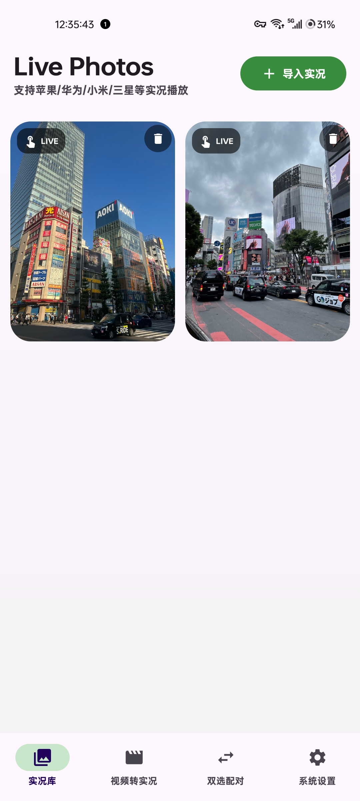
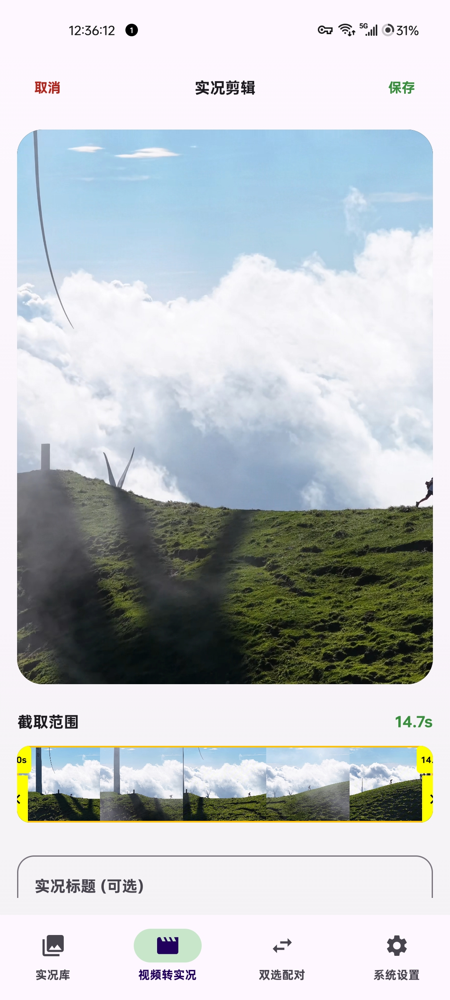
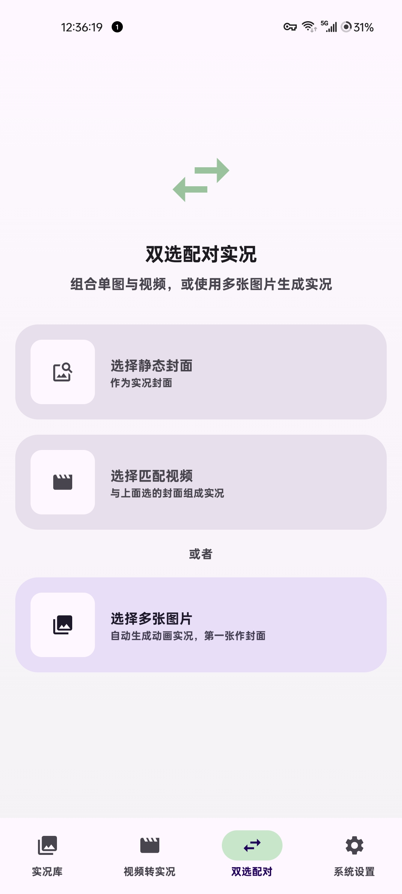
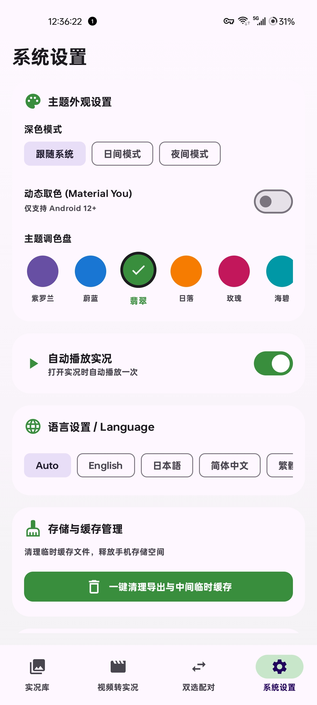

# MotionCraft (Live Photos Studio)

<p align="center">
  
</p>

<p align="center">
  <b>Android 实况照片 (Live Photos / Motion Photos) 查看、转换、合成与批量管理应用</b>
</p>

<p align="center">
  <a href="README.md"><b>English Documentation (英文版)</b></a>
</p>

<p align="center">
  <a href="LICENSE"></a>
  <a href="https://kotlinlang.org"></a>
  <a href="https://developer.android.com/jetpack/compose"></a>
  <a href="https://www.android.com/"></a>
  <a href="CHANGELOG.md"></a>
</p>

---

## 项目简介

**MotionCraft** 是一款运行于 Android 平台的实况照片工具。
应用提供实况照片扫描播放、提取视频/封面、视频转实况照片以及图片视频配对合成功能。

---

## 格式与平台支持

| 平台 / 格式 | 状态 |
| :--- | :---: |
| **Google Motion Photo** | 已支持 |
| **Xiaomi 小米实况照片** | 已支持 |
| **OPPO / OnePlus 实况照片** | 已支持 |
| **抖音实况照片分享 / 识别** | 已支持 |
| **Apple Live Photo** | 开发中 |
| **vivo / iQOO 实况照片** | 开发中 |

> 不同厂商的实况照片实现并不完全相同。即使都采用“静态图片 + 动态视频”的基本结构，其 XMP、EXIF、MP4 封装、文件布局以及厂商私有元数据仍可能存在差异。
>
> 平台状态以 MotionCraft 当前实际完成的兼容性为准。

---

## 核心功能

- **实况图集管理**
  - 自动扫描本地相册中包含微视频 (`MicroVideoOffset`) 的实况照片。
  - 支持网格列表查看与长按多选批量删除。
- **实况照片播放**
  - 长按卡片即可播放动态微视频，支持全屏预览与手势交互。
- **视频与实况互转**
  - 从普通视频生成标准的 Android Motion Photo (JPEG + MP4)。
  - 从 Live Photo 中提取独立的 MP4 视频与 JPEG 封面图片。
- **图片与视频合成**
  - 支持选择独立的图片与短视频，写入 XMP 元数据并合成为实况照片。
- **高清单帧截取**
  - 支持逐帧定位微视频，从实况照片中提取导出清晰的静态单帧图片。
- **XMP 元数据查看**
  - 查看媒体文件的 `GCamera:MicroVideo` 和 `MicroVideoOffset` 等元数据参数。
- **个性化主题与多语言**
  - 支持 Material You 动态取色、深色模式与多种强调色切换。
  - 内置简体中文、繁体中文、英语、日语多语言即时切换。
- **系统诊断与日志**
  - 内置运行时操作交互日志，支持调试悬浮窗与一键复制分享。

---

## 应用界面

| 实况图集 | 视频转实况 | 双选配对 | 系统设置 |
| :---: | :---: | :---: | :---: |
|  |  |  |  |
| 本地实况照片识别与展示 | 视频截取封面与合成 | 图片与视频手动合并 | 基础配置与主题设置 |

---

## 技术原理

Android Motion Photo 格式将 JPEG 封面图与 MP4 视频文件存储在同一文件中：

```
+--------------------------------+----------------------------+
|  JPEG Image Data               |  Embedded MP4 Video Data   |
|  (Contains XMP App1 Segment)   |  (At the end of file)      |
+--------------------------------+----------------------------+
  ^                              ^
  |                              |
  +-- MicroVideoOffset Specifies -+
```

1. **XMP 偏移定位**：读取 JPEG 标头（`0xFFE1` APP1 Marker），解析 `GCamera:MicroVideoOffset` 获取末尾 MP4 视频流的起始字节位置。
2. **视频提取**：使用 `RandomAccessFile` 根据偏移量直接定位并读取尾部 MP4 数据。
3. **播放控制**：基于 Media3 ExoPlayer 绑定 Compose View 进行手势触发播放。

---

## 项目结构

```
MotionCraft/
├── app/                        # Android 应用主模块
│   ├── build.gradle.kts        # 模块构建配置 (纯 64 位 ABI 过滤与混淆)
│   ├── proguard-rules.pro      # ProGuard / R8 优化混淆规则
│   └── src/
│       ├── main/
│       │   ├── AndroidManifest.xml
│       │   ├── java/com/example/
│       │   │   ├── MainActivity.kt
│       │   │   ├── core/       # 核心转换引擎与媒体协议
│       │   │   │   ├── converter/     # 实况格式转换器
│       │   │   │   ├── media/         # 图像处理器、视频转码与帧缓存
│       │   │   │   └── protocol/      # 各厂商实况协议定义与打包封装
│       │   │   ├── data/       # Room 数据库与实况索引持久化
│       │   │   ├── ui/         # Jetpack Compose 界面与组件
│       │   │   │   ├── LivePhotoApp.kt# 主界面与导航栏
│       │   │   │   ├── components/    # 播放器、卡片、波浪滑块与抽屉组件
│       │   │   │   ├── screens/       # 图集、转换、配对、诊断与设置页面
│       │   │   │   └── theme/         # Material 3 动态色彩与排版主题
│       │   │   ├── util/       # XMP 探测解析与日志管理器
│       │   │   └── viewmodel/  # 全局状态管理 ViewModel
│       │   └── res/            # 图标、多语言字符串 (zh/en/ja) 与主题
│       └── test/               # 单元测试与 Robolectric 测试
├── .github/                    # CI/CD 自动化构建与发布配置
│   ├── ISSUE_TEMPLATE/         # Bug 报告与功能建议模板
│   └── workflows/              # 自动打包 Release 与持续集成工作流
├── Screenshot/                 # 应用截图与白底应用图标
├── CONTRIBUTING.md             # 贡献指南
├── CHANGELOG.md                # 更新日志
├── SECURITY.md                 # 安全政策
├── LICENSE                     # 开源协议 (Apache 2.0)
├── README_zh.md                # 简体中文说明文档
└── README.md                   # 英文说明文档
```

---

## 构建说明

使用 Gradle 编译 Release APK：

```bash
./gradlew assembleRelease
```

构建产物目录：`app/build/outputs/apk/release/`

---

## 系统要求与权限

### 系统要求
- **系统版本**：Android 8.0 (API Level 26) 及更高版本
- **处理器架构**：`arm64-v8a` / `x86_64`（纯 64 位）

### 权限说明
- `READ_MEDIA_IMAGES` / `READ_MEDIA_VIDEO`：Android 13+ 本地实况照片及视频读取
- `READ_EXTERNAL_STORAGE`：Android 12 及以下读取本地媒体文件
- `WRITE_EXTERNAL_STORAGE`：Android 9 及以下保存生成的实况照片到相册

---

## 开源协议

本项目基于 [Apache 2.0 License](LICENSE) 协议开源。
